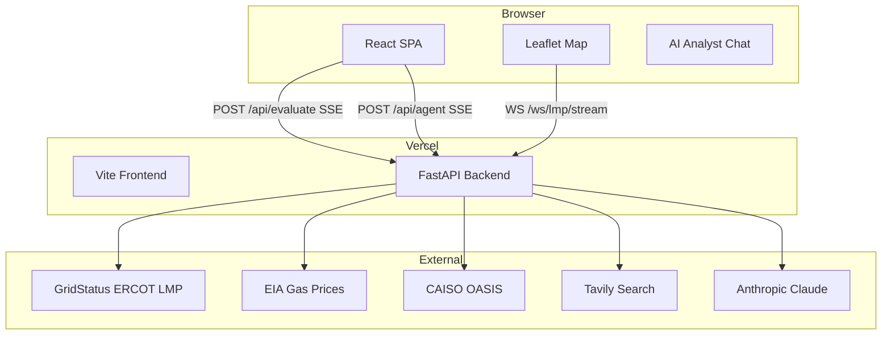
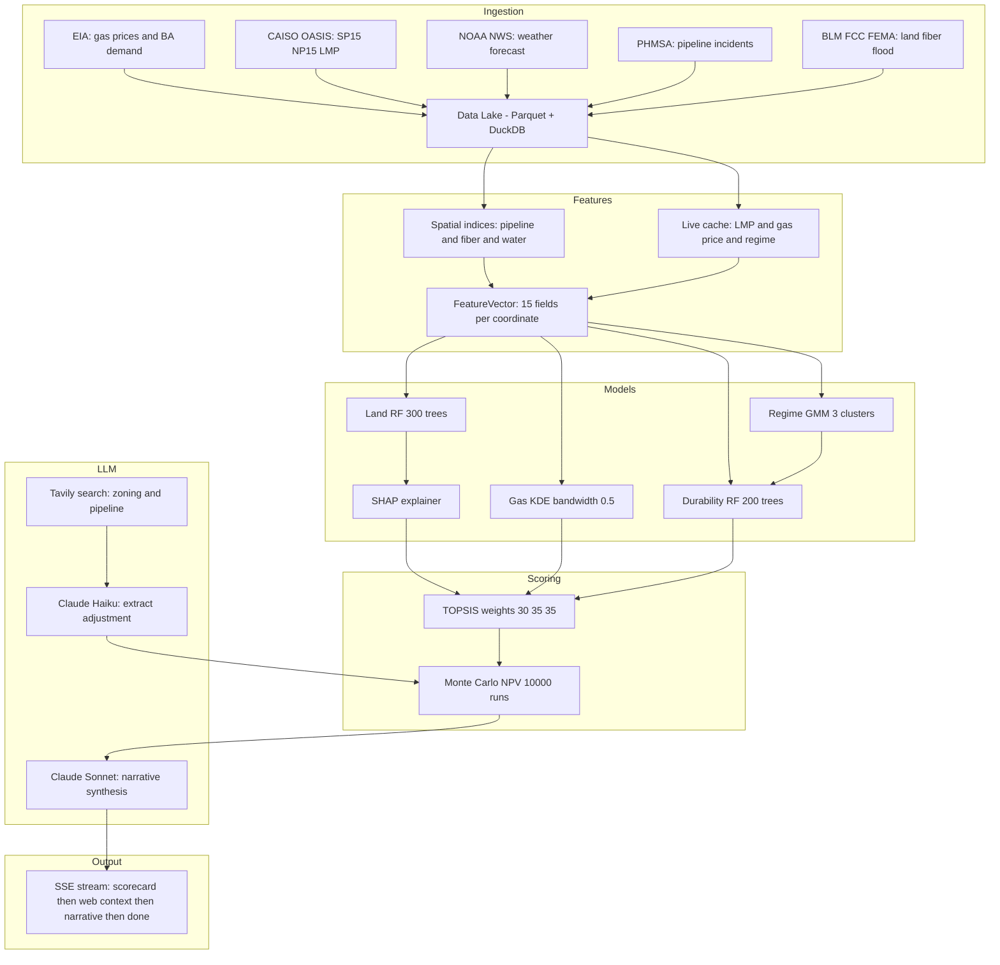
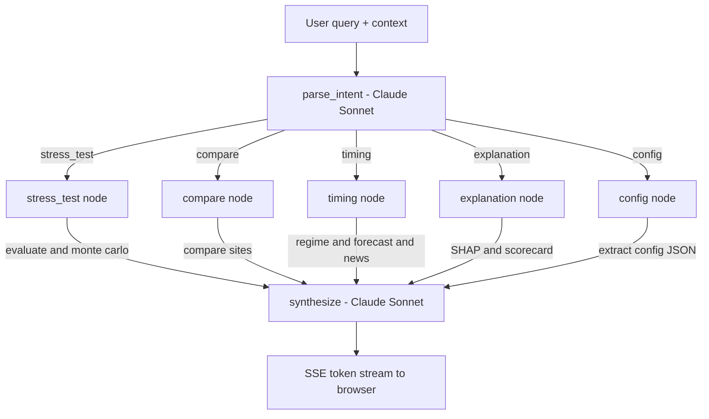
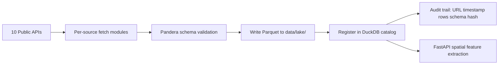

# System Architecture

COLLIDE has two parts: a React SPA on the frontend and a Python FastAPI backend. They communicate through REST, server-sent events (SSE), and a WebSocket for live LMP data.

## Stack

| Layer | Technology | Purpose |
|---|---|---|
| Frontend | React 18, Vite | UI, state, routing |
| Maps | Leaflet + React-Leaflet | Interactive site map |
| Charts | Recharts | Price history, forecast confidence bands |
| Backend | Python FastAPI | API, scoring engine, AI agent |
| AI orchestration | LangGraph + LangChain | Multi-step AI agent graph |
| LLM | Anthropic Claude Haiku + Sonnet | Scoring narratives, intent parsing |
| Live data | GridStatus, EIA, CAISO OASIS | Real-time LMP and gas prices |
| Web enrichment | Tavily API | Zoning and pipeline news search |
| Job scheduler | APScheduler | Background data refresh |
| Deployment | Vercel experimentalServices | Frontend + FastAPI as co-deployed services |

## System overview

## System layers

The backend is organized into four vertical layers. Data flows top-to-bottom: raw sources become features, features feed models, model outputs feed the LLM, and the LLM generates the final scorecard narrative.

## Frontend

The frontend is a single-page React app. All state lives in custom hooks — there is no Redux or global state library. The main component is `App.jsx`, which wires the map, panels, and overlays together via a lightweight custom event bus (`window.dispatchEvent`).

**Key hooks:**

| Hook | What it does |
|---|---|
| `useEvaluate` | Streams a scorecard for a clicked coordinate via SSE |
| `useOptimize` | Runs a grid search and streams top-N candidates |
| `useAgent` | AI Analyst chat — streams tokens as they arrive |
| `useCompare` | Fetches comparison results for pinned sites |
| `useMarket` | Polls live gas prices and LMP every 30 s |
| `useForecast` | Fetches the 72 h P10/P50/P90 LMP forecast |
| `useLmpStream` | WebSocket subscription for live ERCOT LMP ticks |

## Backend

The backend is a FastAPI app with fully async endpoints. Scoring-heavy operations stream results back via SSE so the UI shows progress incrementally — you see the scorecard scores before the AI narrative finishes generating.

**Background jobs (APScheduler):**

| Interval | Job |
|---|---|
| Every 5 min | GridStatus LMP poll + regime reclassification + Waha gas price cache |
| Every 30 min | Tavily news fetch for AI Analyst context |
| Every 1 hr | Moirai 72 h LMP forecast regeneration |

## AI Agent system (LangGraph)

The AI Analyst uses a LangGraph `StateGraph` with 7 nodes. Every query goes through intent classification first, then routes to a specialised tool-running node, then converges at synthesis.

**Node responsibilities:**

| Node | Model | Tools used |
|---|---|---|
| `parse_intent` | Claude Sonnet / heuristic fallback | — |
| `stress_test` | — | `evaluate_site`, `run_monte_carlo` |
| `compare` | — | `compare_sites`, `evaluate_site` |
| `timing` | — | `get_lmp_forecast`, `get_news_digest`, `compare_sites` |
| `explanation` | — | SHAP values from active scorecard |
| `config` | Claude Sonnet | — |
| `synthesize` | Claude Sonnet | — |

## Streaming

Three endpoints stream incremental results via SSE:

- `POST /api/evaluate` — emits `scorecard` → `web_context` → `narrative` → `done`
- `POST /api/optimize` — emits `progress` → `result` (repeated) → `done`
- `POST /api/agent` — emits `token` (repeated) → `citations` → `done`

The WebSocket at `/ws/lmp/stream` pushes live ERCOT LMP ticks every 5 minutes, used by the live ticker in the bottom strip.

## Data pipeline (ingestion)

The ingestion module is a separate Python package that runs independently from the backend. It fetches raw data, validates it, stores Parquet files, and registers them in a DuckDB catalog.

Each dataset has a Pandera schema contract that validates column types, value ranges, and required fields. Rows that fail are quarantined, not silently dropped. Every ingest run writes an audit record so any data point can be traced back to its original API response.
