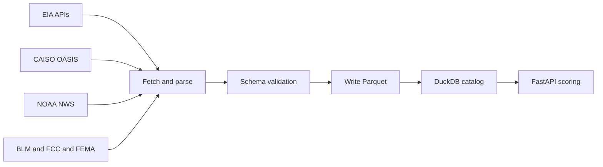

# Data Sources & Pipeline

COLLIDE ingests data from 10 public APIs. All data is stored as Parquet, validated against schemas, and catalogued in DuckDB.

## Data sources

| Source | Dataset | What it provides | Cadence |
|---|---|---|---|
| EIA-930 | `eia930` | BA demand, net generation, forecast by fuel type | 15 min |
| EIA Open Data | `eia_ng` | Henry Hub + Waha natural gas spot prices | Daily |
| CAISO OASIS | `caiso_lmp` | SP15, NP15, Palo Verde 5-min LMP | 5 min |
| NOAA NWS | `noaa_forecast` | Phoenix area weather forecast (temp, wind) | Hourly |
| NOAA ASOS | `noaa_obs` | KPHX station observations | Hourly |
| BLM GeoBOB | `blm_sma` | Federal land ownership for AZ, NM, TX | Static |
| FCC HIFLD | `hifld_fiber` | National dark fiber and FTTP availability | Static |
| USGS NHD | `nhd_waterbody` | Water body locations for cooling water proximity | Static |
| FEMA | `fema_floodplain` | 100-year flood zone boundaries | Periodic |
| EIA Gas | `pipelines_infra` | Gas pipeline routes across ERCOT and WECC | Periodic |

Static sources are refreshed quarterly. Periodic sources are checked for updates weekly.

## Pipeline flow



## Data quality guarantees

Every dataset in the pipeline has:

- **Schema contract** — Pandera validates column types, value ranges, and required fields. Rows that fail are quarantined and logged, not silently dropped.
- **Freshness check** — Each dataset has a max-staleness threshold. If fresh data isn't available the API falls back to the last known good values and sets a `stale: true` flag in the response.
- **Audit trail** — Every ingest run writes a record: source URL, timestamp, row count, pass/fail counts, schema hash.
- **Lineage** — The DuckDB catalog tracks which Parquet file each API response came from, so any data point can be traced back to its original source.

## Background refresh schedule

The backend runs three types of recurring jobs:

| Interval | What runs |
|---|---|
| Every 5 min | GridStatus LMP poll + regime reclassification + Waha gas price cache update |
| Every 30 min | Tavily news fetch (industry headlines for AI Analyst context) |
| Every 1 hr | Moirai 72-hour LMP forecast regeneration |

## Running the pipeline manually

Trigger the full ingestion pipeline from the app:

```
POST /api/pipeline/run
```

Or click **Run Pipeline** in the Data Quality section at the bottom of the main page.

To run specific datasets only, use the ingestion module directly:

```bash
cd ingestion
python -m ingestion.run --sources eia_ng,caiso_lmp
```
