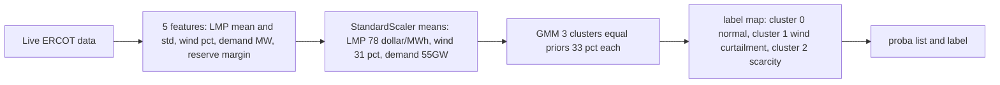
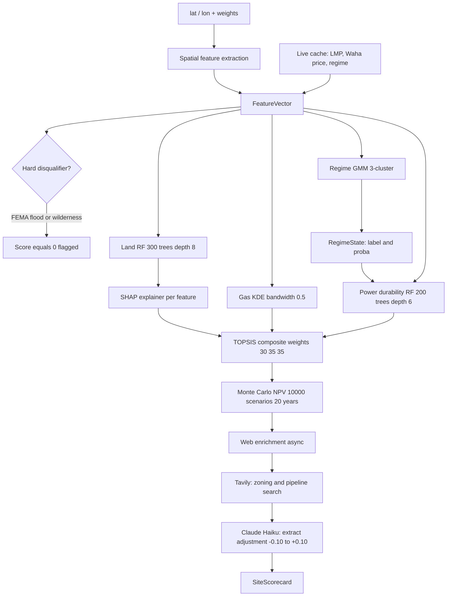
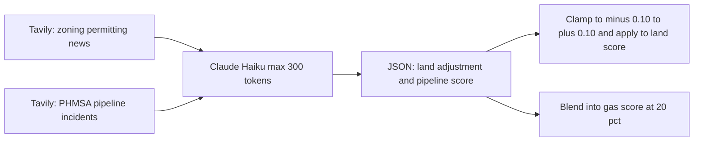

# How the Scoring Works

Every site gets scored across three independent dimensions — land, gas, and power — then combined into a composite score using TOPSIS. Here's exactly how that works, including the actual model architectures and weights.

## The three dimensions

### Sub-A: Land viability

Scores how suitable the land parcel is for a BTM data center.

**Inputs (10 features):**
- Distance to highway, substation, pipeline, water, dark fiber (km each)
- Land ownership type (private / state / BLM federal)
- FEMA flood zone classification
- Seismic hazard index
- Wildfire risk index
- EPA air quality attainment status

**Model: Random Forest Classifier**
- 300 decision trees, max depth 8
- Trained on synthetic + public parcel data
- Output: `predict_proba()[1]` → probability of site being viable (0–1)

**Feature importances (from `land_rf.pkl`):**

| Feature | RF importance | Rule-based weight |
|---|---|---|
| highway_km | 28.5% | 7% |
| substation_km | 23.7% | 8% |
| pipeline_km | 19.9% | 10% |
| water_km | 14.6% | 15% |
| fiber_km | 8.1% | 12% |
| seismic_hazard | 1.6% | 8% |
| fema_zone | 1.4% | 10% |
| ownership_type | 1.1% | 18% |
| epa_attainment | 0.6% | 5% |
| wildfire_risk | 0.4% | 7% |

The RF model learned that highway and substation access matter more than the rule-based weights assumed. SHAP values from `land_rf.shap.pkl` are returned per-evaluation to explain individual site scores.

**Hard disqualifier:** Sites inside a FEMA A/AE/V flood zone score 0 regardless of other factors. Federal wilderness also disqualifies.

**Fallback:** If the pkl model is unavailable, a weighted rule-based formula runs instead using the rule-based weights in the table above.

---

### Sub-B: Gas supply reliability

Scores how reliable the gas supply infrastructure is at this location.

**Model: GPU Gaussian KDE (Kernel Density Estimator)**
- Loaded from `gas_kde.pkl`
- Bandwidth: 0.5 (Gaussian kernel in lat/lon space)
- Trained on PHMSA incident coordinates (weighted by incident severity)
- Outputs log-density at query coordinate

**Scoring formula:**

```
incident_score  = clamp(1 − (log_density + 15) / 12, 0, 1)
pipeline_score  = clamp(1 − interstate_km / 100, 0, 1)
waha_score      = clamp(1 − waha_dist_km / 400, 0, 1)

gas_score = incident × 0.40 + pipeline × 0.35 + waha × 0.25
```

**Component weights:**

| Component | Weight | Interpretation |
|---|---|---|
| Incident density (KDE) | 40% | PHMSA pipeline failure probability at this coordinate |
| Interstate pipeline proximity | 35% | Distance to nearest interstate supply point |
| Waha Hub distance | 25% | Distance to primary Permian Basin hub |

**With web enrichment:** When Tavily + Claude Haiku return a pipeline reliability opinion, it blends in at 20% and the base weights are scaled to 80%.

**Fallback (no KDE):** `incident_score = 1 − min(incident_density × 200, 1)` using a simple PHMSA density grid.

---

### Sub-C: Power economics

Scores whether BTM gas generation is economically viable here.

**BTM spread calculation:**
```
btm_cost     = waha_price × 8.5 (heat rate, MMBtu/MWh) + $3.00 (O&M)
spread_p50   = LMP_p50 − btm_cost        (positive = BTM cheaper than grid)
spread_score = clamp(spread_p50 / 20, 0, 1)
```

**Durability model: Random Forest Classifier**
- 200 decision trees, max depth 6
- Loaded from `power_durability.pkl`
- Predicts probability that positive spread persists given current regime
- Input features: LMP, Waha price, regime encoding, wind penetration, demand

**Feature importances (from `power_durability.pkl`):**

| Feature | RF importance |
|---|---|
| lmp_mwh | 68.4% |
| regime_enc | 30.9% |
| waha_price | 0.8% |
| wind_pct | 0.0% |
| demand_gw | 0.0% |

LMP level and market regime together explain 99%+ of spread durability.

**Final power score:**
```
power_score = spread_score × 0.60 + spread_durability × 0.40
```

**Fallback (no durability model):** Regime-conditional lookup table.

| Regime | Fallback durability |
|---|---|
| stress_scarcity | 0.75 |
| normal | 0.60 |
| wind_curtailment | 0.35 |

---

## Market regime classifier

Before power scoring runs, the market regime is classified — it determines how durable a positive BTM spread is likely to be.

**Model: Gaussian Mixture Model (GMM)**
- 3 components, full covariance matrices
- Loaded from `regime_gmm.pkl`
- Input: 5 live ERCOT features



**Cluster semantics (learned from ERCOT historical data):**

| Cluster | Semantic label | Prior weight | Key characteristic |
|---|---|---|---|
| 0 | Normal | 33.3% | Average LMP, moderate wind |
| 1 | Wind curtailment | 33.4% | High wind (1.2σ above mean), low demand, low LMP |
| 2 | Stress / scarcity | 33.3% | High LMP (1.25σ), high demand, low reserve margin |

**Scaler training means** (what "normal" looks like on ERCOT):

| Feature | Training mean |
|---|---|
| LMP mean | $78.3/MWh |
| LMP std | $37.1/MWh |
| Wind penetration | 31.1% |
| Demand | 54,867 MW |
| Reserve margin | 18.4% |

---

## Full scoring pipeline



## TOPSIS composite weights

| Dimension | Weight | Rationale |
|---|---|---|
| Land (Sub-A) | 30% | Least volatile — parcel attributes don't shift with market conditions |
| Gas (Sub-B) | 35% | Critical path — supply failure is existential for BTM operation |
| Power (Sub-C) | 35% | Drives the NPV; most sensitive to gas price and LMP changes |

You can override these in the Optimizer config dialog.

## Cost estimation

For each scored site, COLLIDE estimates a 20-year NPV using a Monte Carlo simulation (10,000 scenarios):

**Cost constants:**

| Parameter | Value |
|---|---|
| BTM capex | $800/kW |
| Pipeline connection | $1.2M/mile |
| Water connection | $400K/mile |
| Heat rate (CCGT) | 8.5 MMBtu/MWh |
| O&M | $3.00/MWh |
| Gas price volatility (1σ) | 30% of spot |
| LMP volatility (1σ) | 20% of spot |
| WACC | 8% |
| Plant capacity | 100 MW |

**NPV formula (per scenario):**
```
spread_t     = LMP_t − (gas_t × 8.5 + 3.0)          # $/MWh
revenue_t    = max(spread_t, 0) × 876,000 MWh / $1M  # $M/yr
NPV          = Σ revenue_t / (1.08)^t − capex         # 20yr discounted
```

Output is P10 / P50 / P90 NPV in $M. The P50 is shown in the scorecard.

## Web enrichment (LLM layer)

After the ML scoring pipeline finishes, an async enrichment step runs in parallel with narrative generation:

1. **Tavily** fires two concurrent searches: zoning/permitting news + PHMSA pipeline incidents
2. **Claude Haiku** (`claude-haiku-4-5-20251001`) reads the results and returns a structured JSON with `land_adjustment` (−0.10 to +0.10) and `pipeline_score` (0–1)
3. The land adjustment is clipped to ±0.10 and added to the RF land score
4. Results are cached at 0.5° grid resolution (~55 km) for the process lifetime


